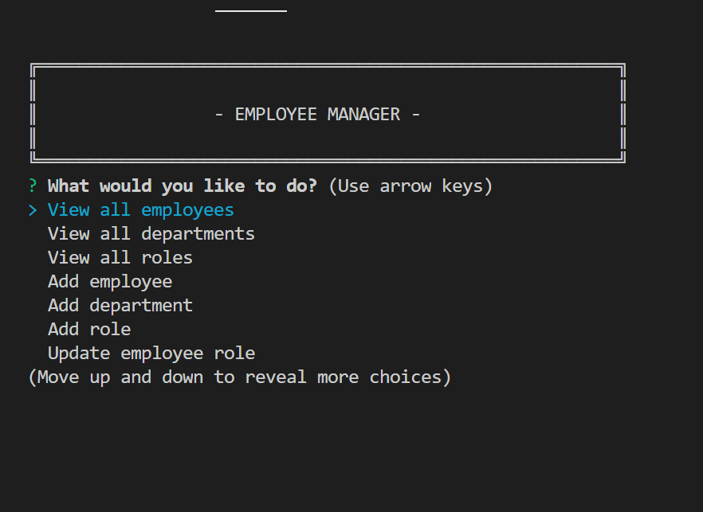
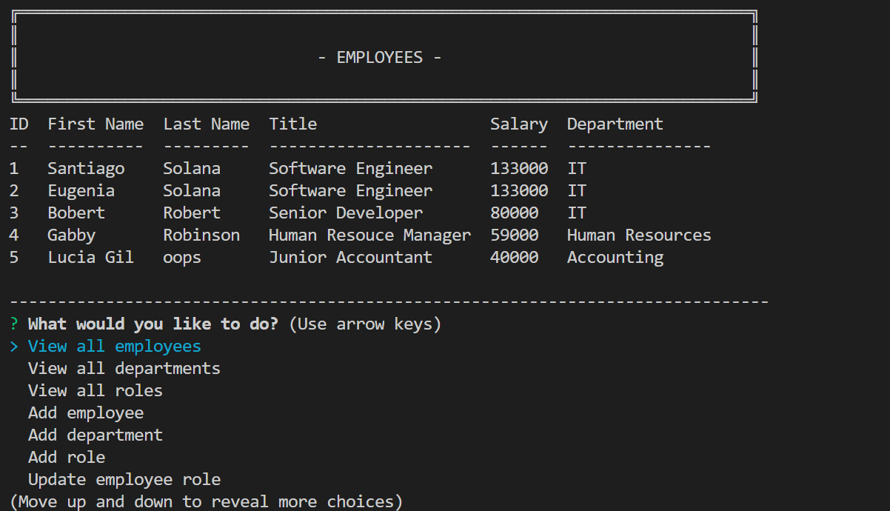

# Employee Managment System     

A comand line application Which allows the user or employer to add new employees, roles, and departments to their MySQL employee database. It then provides the user with options to view update a delete said items.

### Demo
Click [HERE](https://www.youtube.com/watch?v=RP5Hkt7k4Fk&feature=youtu.be) for a video demosntration on how this application works.

    
## Table of Contents
    
1. [Installation](#installation)
2. [Usage](#usage)
3. [Contributing](#contributing)
4. [Test](#test)
5. [Questions](#questions)
6. [License](#license)
    
# Installation
This appliaction does not require installation but does need Node.js to be installed and a working MySQL connection for the database.
# Usage
 - Navigate to this directory in your command line 
 - Run npm i to install all dependencies 
 - From here you will be provide with options to view add update and delete employees roles and department to your database 
 - select option and follow provided instruction
# Contributing
No guidelines for contribution. you are free to modify and expand this application to your liking
# Test
No testing used or required
# Questions
If you have any questions or would like to contact me feel free to reach me at:
- Email: santiago.sjs@gmail.com
- Github: [santu14](https://github.com/santu14)

## License

                Copyright 2020  Santiago Solana

    Permission to use, copy, modify, and/or distribute this software for any purpose with or without fee is hereby granted, provided that the above copyright notice and this permission notice appear in all copies.
